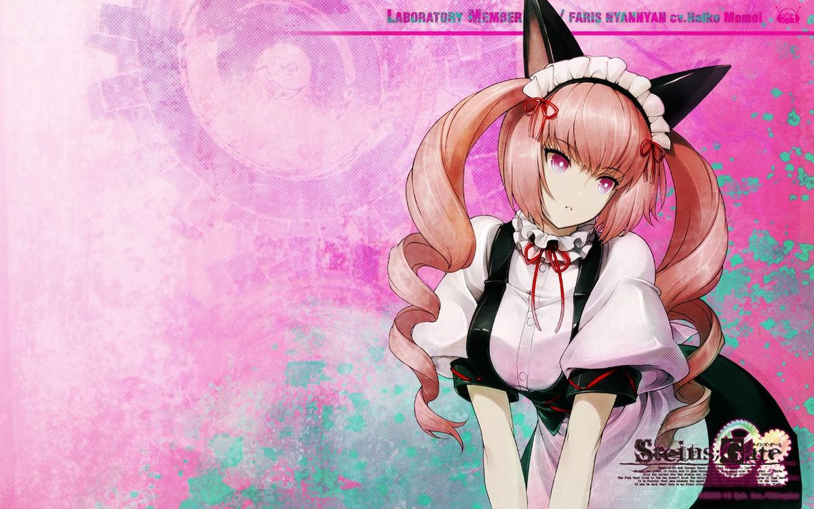

<!--📏LINE-->

  

 

  <table align="center" cellspacing="0" cellpadding="0">
    <tr>
      <td align="center" width="300">
        
         
        <b>nefous</b>
      </td>
      <td align="center" width="300">
        
         
        <b>@nefouskywalker</b>
      </td>
    </tr>
  </table>

  

<!--📏LINE-->

  

